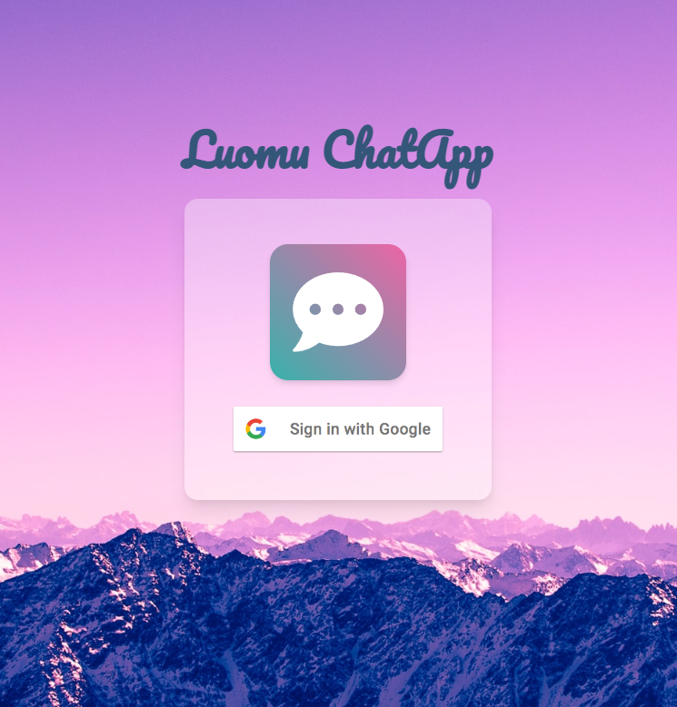

# Luomu Chatapp🍀

This project was bootstrapped with [Create React App](https://github.com/facebook/create-react-app).


## Website demo
[https://luomu-chatapp.netlify.app](https://luomu-chatapp.netlify.app)



### Features
- Create 1:1 chatroom
- Send message
- Delete message(only for owned user)
- Responsive design

### Firestore collection "chats" firestore structure

```javascript
const chats = [
  {
    users: ['1111@gmail.com', '2222@gmail.com'],
    messages: [
      {
        text: 'Hello, my friend!',
        timestamp: '',
        sender: '1111@gmail.com',
      },
      {
        text: 'Hola, mi amigo!',
        timestamp: '',
        sender: '2222@gmail.com',
      },
    ],
  },
];

```